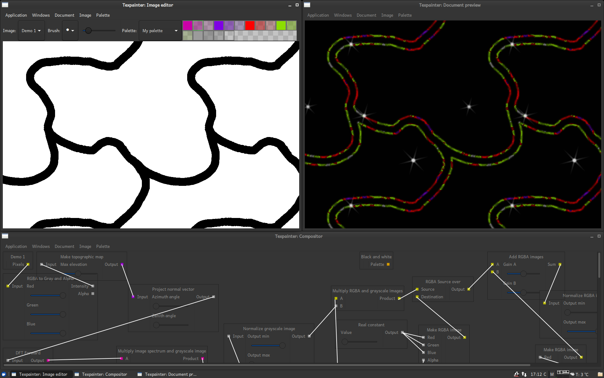

# Texpainter

Texpainter is a utility program intended for creating tilable textures. It consists of *very* basic raster graphics editor (more basic than Ms Paint, though it supports transparency), combined with a powerful node based compositor, through which multiple images can be processed and combined to a single image.

## How to compile

### On *ubuntu

 1. Install
    * bsdmainutils
    * pkg-config
    * libfftw3-dev
    * libopenexr-dev
    * libgtk-3-dev
    * nlohmann-json3-dev
    * libnotify-dev
    * python3-pygit2
    * pandoc
    * imagemagick
    * libmagickcore-6.q16-6-extra
    * libglew-dev
    * libglm-dev

    If you do not have it, also install g++ version 10 or later, since the code uses some new features from C++20.

 2. Install maike, and wad64, currently avaiable in the ppa:s https://launchpad.net/~milasudril/+archive/ubuntu/maike
    and https://launchpad.net/~milasudril/+archive/ubuntu/wad64 That is,

        sudo add-apt-repository ppa:milasudril/maike
        sudo add-apt-repository ppa:milasudril/wad64
        sudo apt-get update
        sudo apt-get install maike wad64

    Should do the trick

 3. Run make

 4. The binary can now be started with the command `__targets_rel/app/texpainter`