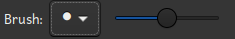

# The brush selector

The brush selector is part of the <a href="image_editor.html">Image editor</a>. A brush has a shape
and a size. The brush selector is used to control these aspects of the current brush.

The shape is selected from the drop-down menu. The slider adjusts the brush size. Move it to the
right to increase the brush size.