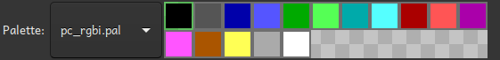

# The color selector

The color selector is part of the <a href="image_editor.html">image editor</a> and is used to select
what color to use when painting. The dropdown menu contains all
<a href="../glossary.html#palette">palette</a>s. To the right of the palette name, its content is
shown. To select a color, click on int with the left mouse button. To change the color, use the
right mouse button. This will bring up a color selection dialog box.

