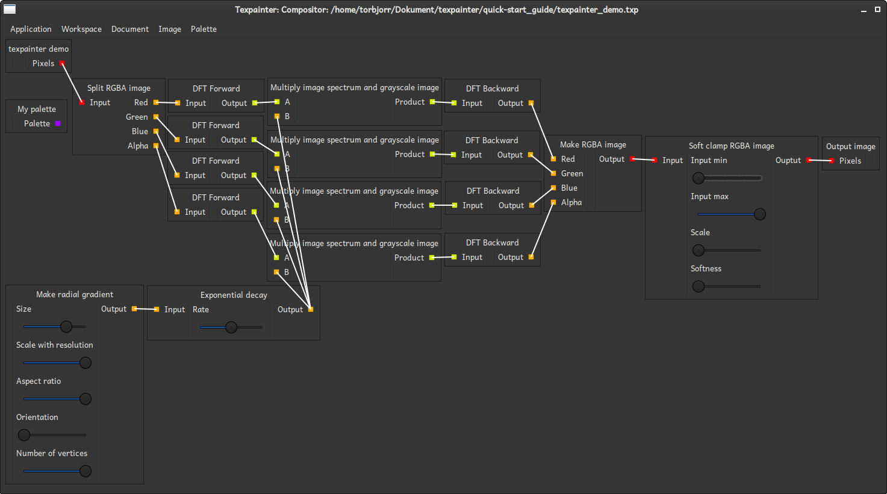
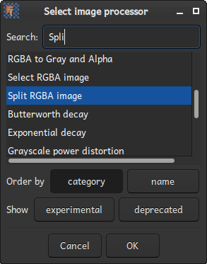

# The compositor

The compositor controls how images are transformed and composed. It provides a description of the
signal flow from different sources to the output <a href="../glossary.html#node">node</a>. Different
nodes are represented by movable boxes. A node wrapps an instance of an
<a href="../glossary.html#image_processor">Image processor</a>, takes up to four inputs, and has up
to four outputs. These inputs and outputs (ports) are represented by colored squares. Input ports
are located on the left side of a node, and output ports are located on the right side. Thus, the
signal flows from left to right.

The signal flow is enabled between two ports is established by a connection. In the view, such a
connection is represented by a line segment between the connected ports. A connection can only be
made if the colors of output and input port matches (red goes to red), and the connection is between
different nodes. For processing to be performed, all input ports must be connected to an output
port. Furthermore, no connections may form a cycle.

<a href="../glossary.html#image">Images</a> and <a href="../glossary.html#palette">palettes</a> can
be used as sources. A source is characterized by the fact that it has no inputs. There are also some
image processors that generate data from a set of fixed parameters. These also work as sources.
There is only one sink, and this is the output image. Behind the scene, the output image node is
connected to the <a href="document_previewer.html">Document previewer</a>. It also represents the
final image to render.

## Adding a node

As soon as an image or a palette is created or imported, they are avaiable for use in the
compositor. Other <a href="../glossary.html#image_processor">Image processor</a>s can be added by
right-clicking in the compositor. It is also possible to press <kbd>Shift</kbd> + <kbd>A</kbd>.
Doing so brings up the image processor selection dialog.

Select the Image processor you want to use and click ok. You can also double click on an item, as
well as press <kbd>Enter</kbd>.

## Copying or deleting a node

A node can be copied or deleted by right-clicking on the node and choose the corresponding item.
This also works for images and palettes. Be aware that removing an image or a palette from the
compositor will also remove them from the document.

## Connecting ports

Ports are connected by first clicking on the first port that should be part of the connection, and
then clicking on the second port. If tries to add a connection to an already occupied input port,
the old connection will be replaced. To cancel the connection procedure. Left-click somewhere in the
void between all nodes.

## Adjusting parameters

Some <a href="../glossary.html#image_processor">Image processor</a>s takes parameters. These are
constant values, that do not depend on the pixel location. Compare this to "uniforms" in GLSL. To
change a parameter, move the corresponding slider in the desired direction.