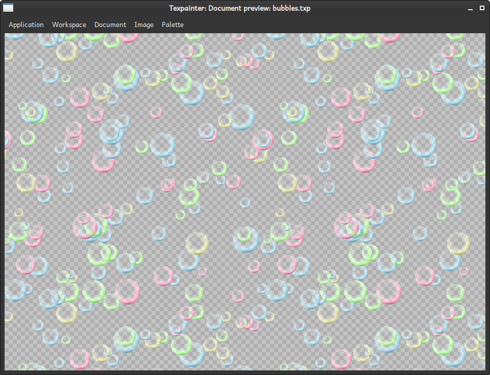
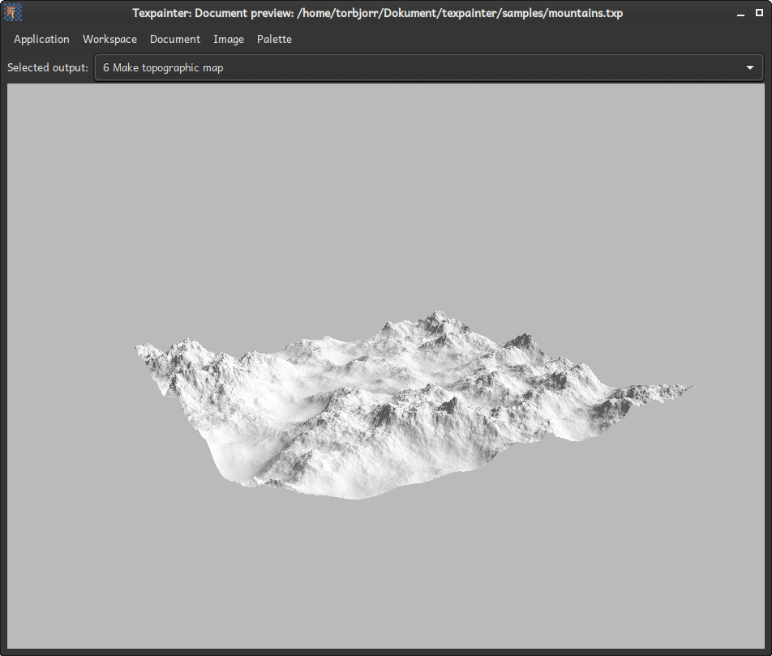

# The document previewer

The document previewer is used to preview the final render. When the selected output node generates a RGBA image, it shows the output image at a scale of 1:2. For a Topographic map, it shows a view of the generated terrain.

