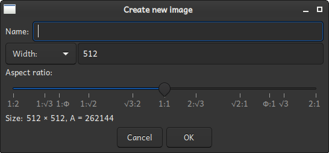

# The image creation dialog

The image creation dialog is used to create a new <a href="../glossary.html#image">Image</a>. A
new image is created by giving it a name and a size. The size input uses a
<a href="size_input.html">size widget</a>. See that page for information on how to use it.

