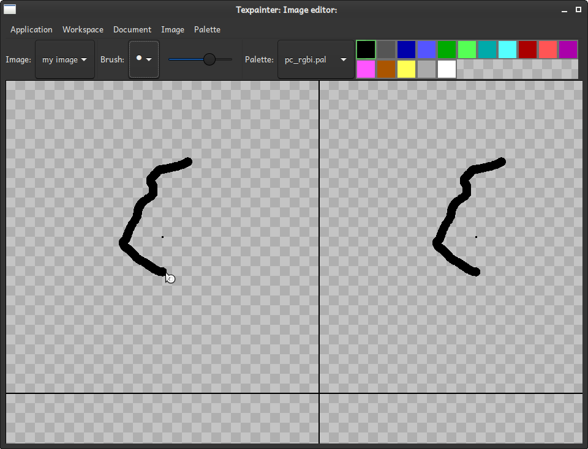

# The image editor

The image editor provides a surfavce to draw images on. You select which image to modify from the
Image dropdown menu. To draw, select a color from the <a href="color_selector.html">palette</a>
and press the left mouse button while the mouse cursor is over the drawing area. To erase what you
have drawn, use the right mouse button. The mouse wheel can be used to change the brush size. If you
cross the image boundary, painting will continue on the opposite edge. This is so you can easliy
create tilable patterns.

In addition to modify the brush size with the mouse wheel, you can use the
<a href="brush_selector.html">brush selector</a>. If keyboard focus is on the drawing area, you can
change the brush shape by prssing <kbd>F1</kbd> - <kbd>F3</kbd>.

## Other features

If you hold down <kbd>Ctrl</kbd> while using the mouse wheel, it will zoom close to to the current
cursor position. This is useful for painting details.

If you use <kbd>Shift</kbd> + left mouse button, you will floodfill the area with the selected
color. If you hold down <kbd>Shift</kbd> and right-click, you will erase the area instead.

There is no "undo" feature in the image editor. The filosophy behind that is that

 1. You can always paint over with something different
 2. If you want to revert your work, you are probably much better of by saving your document and
    use a real version control system like git instead
 3. What is to be considered as a "change" anyway. That is, what granularity to use for actions.