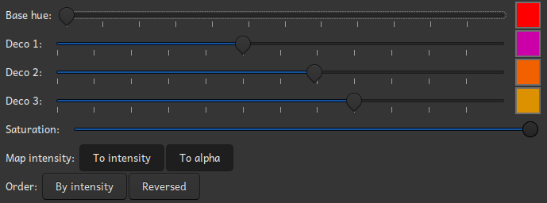

# The palette creator

The palette creator is accessible through the menu option "Generate palette" in the palette
<a href="menubar.html">menu</a>, and its purpose is to make it easier and faster to generate a
suitable palette. It is heavily inspired by <a href="https://paletton.com">paletton.com</a>. The
idea is that you pick a base color, and adjust the hue offset form the base color to create three
additional decoration colors. The saturation affects all colors.

Based on the hues and the saturation, different intensities will be generated. You can choose to
map the intensity to the actual intensity, to the alpha channel, or both of them. If you do not map
the computed intensity to anything, there will only be one intensity.

It is also possible to reverse the palette, and to sort by intensity instead of by color name. The
order could matter if you intent to use the palette as a color map in the compositor.