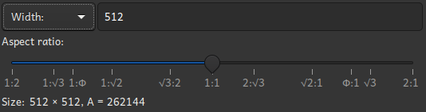

# The size input widget

The size input widget is used to enter a size. It is used when creating a new document, and when
creating a new image. It works by specifieng a length, and an aspect ratio, here defined as the
width divided by the height.

## Operation modes

The size input widget has three operation modes:

 * Width
 * Height
 * Square size

In "Width" mode, the width is given, and the height is computed given the width and the aspect
ratio. In "Height" mode, the hight is given, and the width is computed given the hight and the
aspect ratio. In "Square size" mode, the side of a square is specified, then the width and hight are
computed using the side length and aspect ratio, such that the resulting rectangle has the same area
as the square with the given size.

## Common aspect ratios

The aspect ratio slider has stops for some geometrically important aspect ratios. For reference here
is an explanation of these stops:

|Ratio        | Explanation                                                               |
|-------------|---------------------------------------------------------------------------|
|$1:2$        |Two squares                                                                |
|$1:\sqrt{3}$ |Half of the aspect ratio of an equilateral trianlge                        |
|$1:\Phi$     |The golden section                                                         |
|$1:\sqrt{2}$ |The aspect ratio that makes halfed rectangle similar to the full rectangle |
|$\sqrt{3}:2$ |The aspect ratio of an equilateral trianlge                                |

