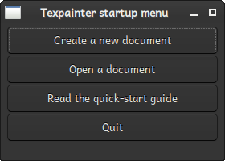

# The startup menu

If Texpainter is started without any command line argument, the startup menu is shown. It provides
different options for how to proceed. An option is selected by clicking on the corresponding button.

The options are

* Create a new document
* Open an existing document
* Read the <a href="../user_guide/quickstart_guide.html">quick-start guide</a>
* Quit