# Quick-start guide
This quick-start guide will show how to create a new texture image, how to apply some filters, and
how to export the resulting image.

## Creating a new texture image

To create a texture image, you first need to create a new document. You can do this by clicking
"Create a new document" in the <a href="../app/startup_menu.html">startup menu</a>. You will also
find the option in the <a href="../app/document_menu.html">Document menu</a>. This will bring up a
dialog box that allows you to specify the canvas size. The canvas is basically the domain where the
final render will be drawn. You will find more information about size specification in the
documentation for the <a href="../app/size_input.html">size input widget</a>.

When you have created a new document, you will have a workspace that looks something like this:

Now you need to create a new <a href="terminology.html#image">image</a> to paint on. You create a
new image from the <a href="../app/image_menu.html">Image menu</a>. After creating a new image, you
will see its name in the <a href="../app/image_editor.html">Image editor</a>. It also appears as a
new <a href="terminology.html#node">node</a> in the <a href="../app/compositor.html">Compositor</a>.

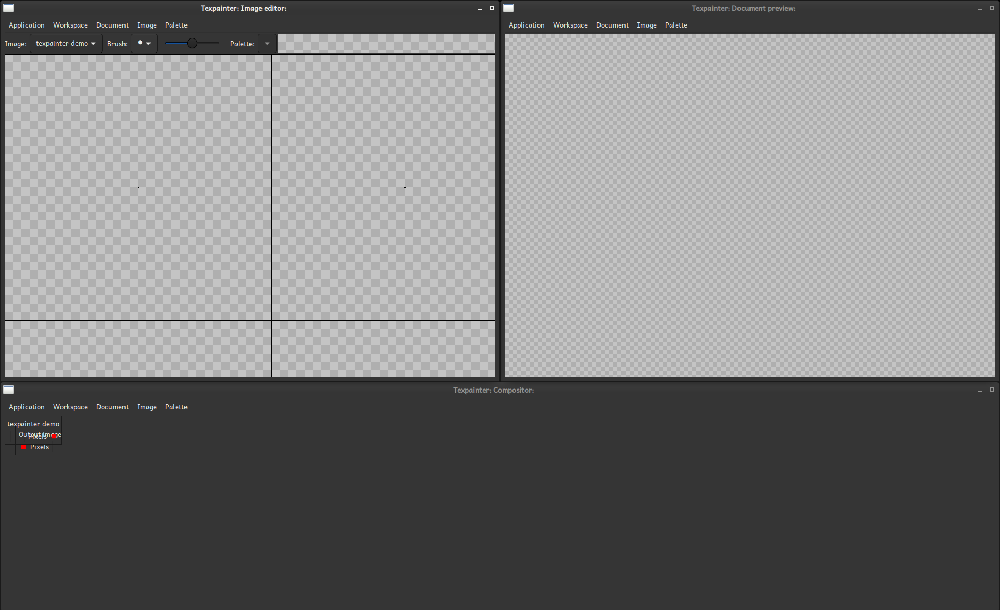

Before you can paint anything, you need to have a <a href="terminology.html#palette">palette</a> to
select a color from. Palettes are managed from the <a href="../app/palette_menu">Palette menu</a>.
To change a color in the palette, right-click on the slot that should have the desired color. To
select what color to paint with, left-click.

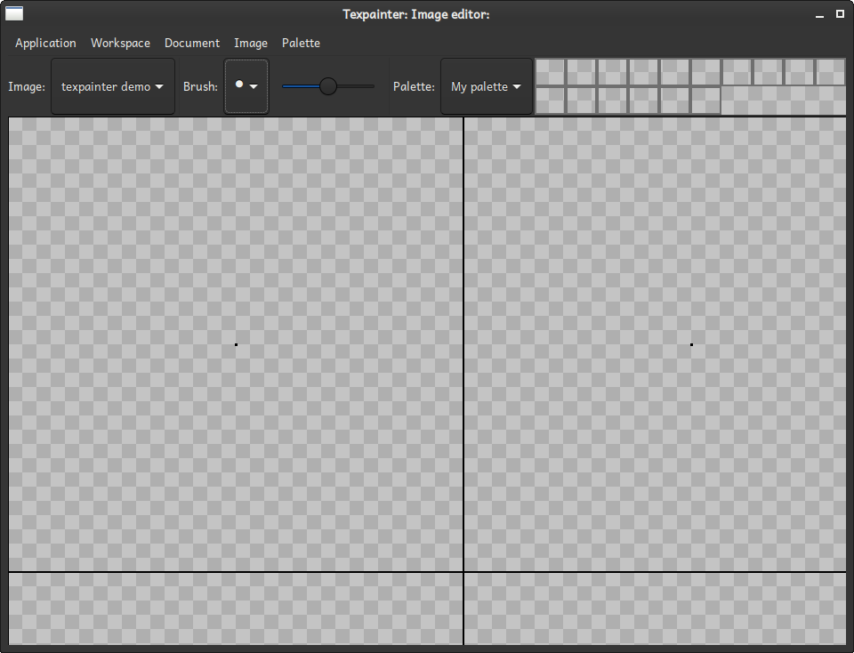

To paint with the selected color, hold down the left mouse button while moving the cursor over the
drawing area. If you want to erase, right-click. Also, try to use the mouse wheel. Notice that the
image you are drawing to repeated. This makes it easy to draw a periodic pattern. If you pass the
image boundary (indicated with a solid line), it will wrap-around.

Now, it is time to have a look at the <a href="../app/compositor.html">Compositor</a>, and the
<a href="../app/document_preview.html">Document preview</a>. Currently, the Document preview shows
a checkerboard pattern. This indicates that there is nothing to be drawn. This is because nothing
has been connected to the input of the output node. To connect the nodes, you probably want to move
them around so you can see everything. To move a node, simply drag its title. It is a good idea to
move the output node to the right.

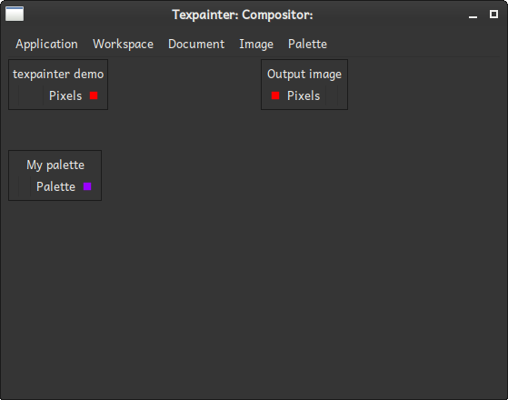

We want to copy the pixels of "texpainter demo" to the "Output image". Left-click either of red
<a href="terminology.html#port">ports</a>. When you move the mouse cursor, you will se a line
segment connecting the port with the mouse cursor.

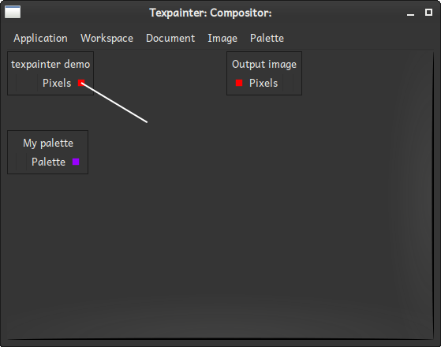

Complete the connection by left-clicking on the other port.

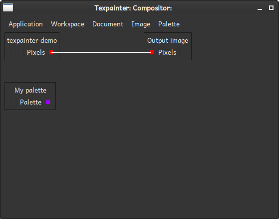

Now, the document preview shows the pattern in scale 1:2.

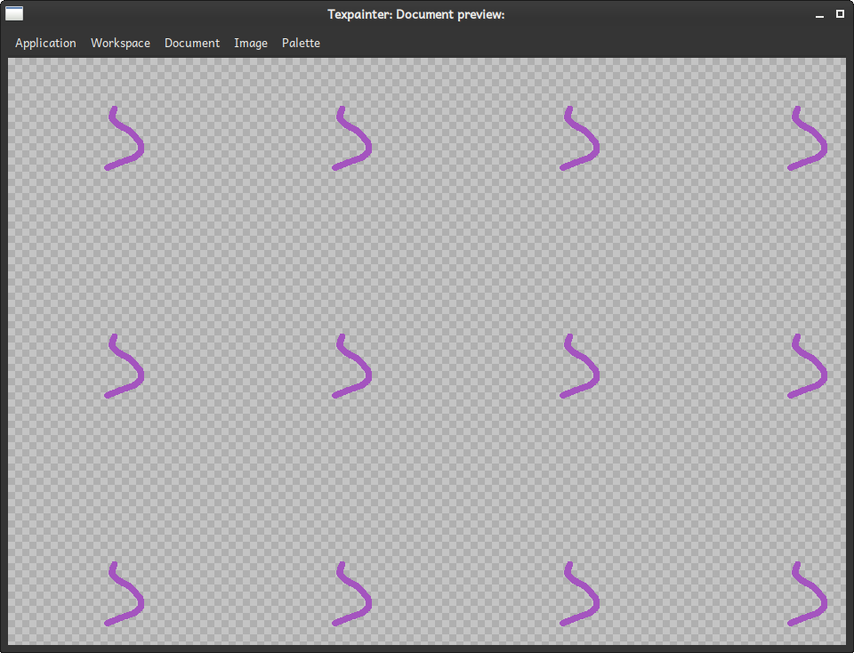

## Applying some filters

Filters are applied by adding <a href="terminology.html#node">node</a>s in the path between the
source image and the output image. This tutorial will demonstrate how to add Gaussian blur to the
image. Gaussian blur is achieved by multipying the <a href="terminology.html#image_spectrum">image
spectrum</a> with a mask, where the intensity is shaped like a Gaussian, ie

$$
I(x, y) = \exp(-(x^2 + y^2)/r_0^2)
$$

This process has to be performed on each color channel individually. Thus, before doing anything,
we must split our color image in four grayscale images. For this purpose, we use the
"Split RGBA image" processor. Right-click somewhere in the
<a href="../app/compositor.html">Compositor</a>, and select "Split RGBA image" from the list.

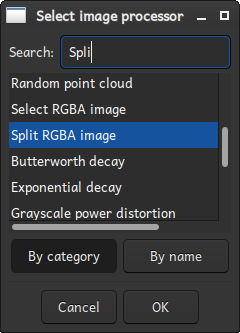

Now, a new node will appear in the Compositor.

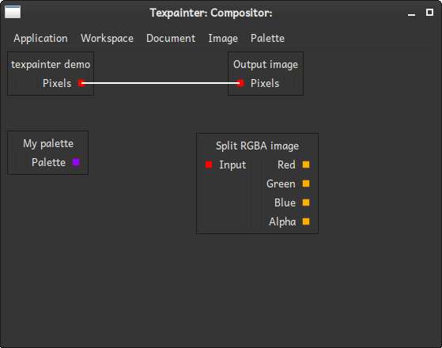

Connect the output port of "texpainter demo" to the input port of "Split RGBA image".

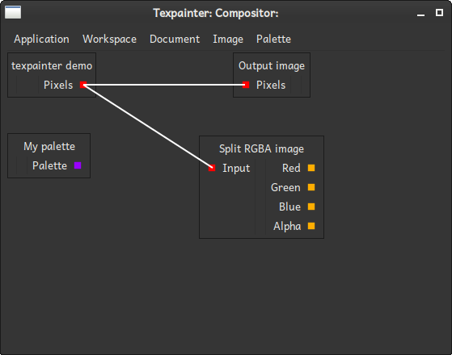

Since we are going to do spectral maniplation of the image, we need to insert an image processor
that can generate an image spectrum. This can be done by the "DFT Forward" processor. Insert an
instance of this in the same way as you inserted the "Split RGBA Image" instance. You will need four
of these, so after you have insert one, you can right-click on it and select copy.

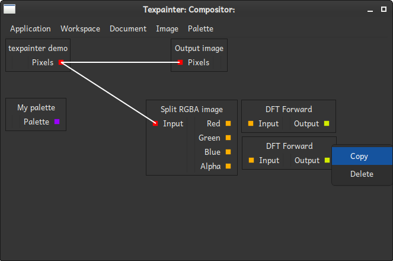

Do this until you have four instances of "DFT Forward". Then connect these nodes to the outputs from
"Split RGBA image".

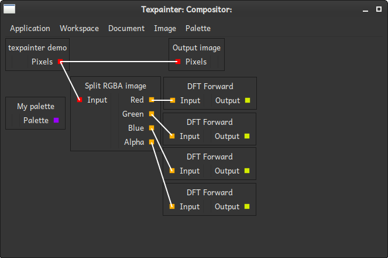

Now, we need to construct our mask. We can create an expression of the form

$$
I_1(x, y) = \frac{x^2 + y^2}{r_0^2}
$$

by using "Make radial gradient". Insert an instance of that image processor. This image processor
has some parameters that we will play with later.

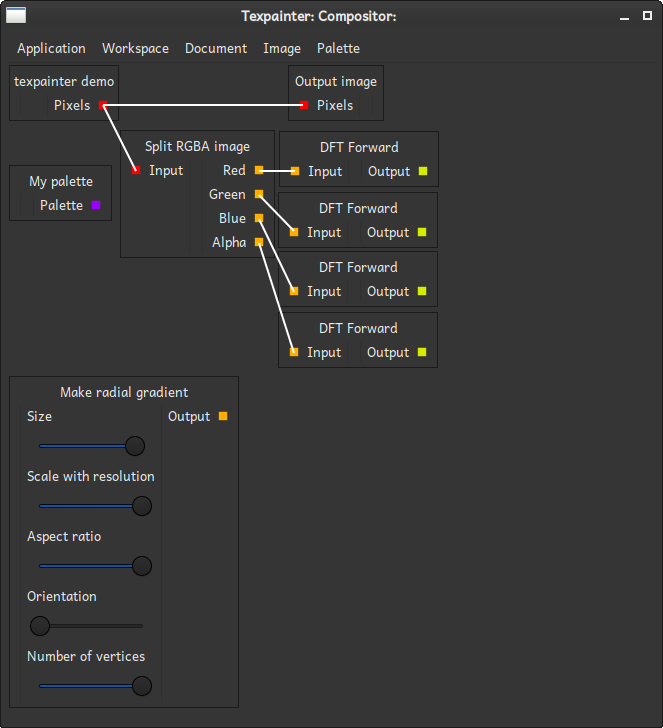

There is an image processor "Exponential decay" that modifies pixel values according to the relation

$$
I_2(x, y) = \exp(-k I_1(x, y))
$$

If we take the output from the "Make radial gradient" instance, and feeds it into an instance of
"Exponential decay", we have constructed the Gaussian mask. Insert an instance of
"Exponential decay" and connect it to the "Make radial gradient" instance.

With the mask finished, it is time to multiply it with the image spectra of all color channels. This
means that four instances of "Multiply image spectrum and grayscale image" are needed. This image
processor has two inputs. The first is expected to be an image spectrum and and a grayscale image.
Insert four "Multiply image spectrum and grayscale image" instances, and connect their inputs. When
connecting nodes, you always follow the port color.

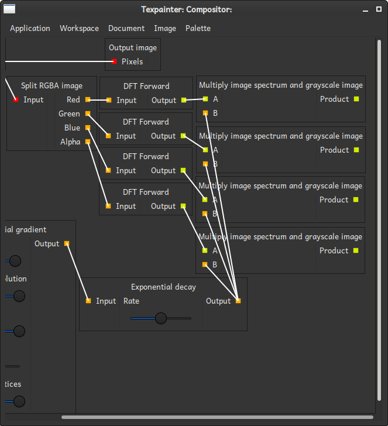

We now have four image spectra that have been multiplied by the mask. To get a visible image, we
need to construct an RGBA image from these. This is done in two steps. First, the spectra are
converted to grayscale images by using the "DFT Backward" image processor. Then, these grayscale
images are combined into an RGBA Image by using "Make RGBA image". After wiring it up the compositor
looks like this:

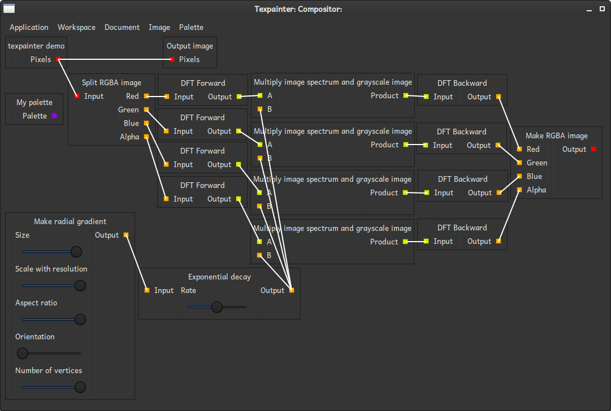

Still, the original image is shown in the <a href="../app/document_preview.html">Document
preview</a>. This is because we have not yet connected the result of the Gaussian blur to the
output node. Connect the output port of "Make RGBA image" to the input port of the "Output image"
node. Notice, that this time it takes some time to finnish the connection. This is because the
output source has changed to something that needs some computation: It has to apply the Gaussian
blur to the image. Anyway, when the computation has completed, the Document preview looks like this:

There are some artifacts in the result. This is because there are values that are outside $[0, 1]$.
Most likely, these come from some numerical inaccuracies from in the DFT operations. This can be
solved by using "Soft clamp RGBA image":

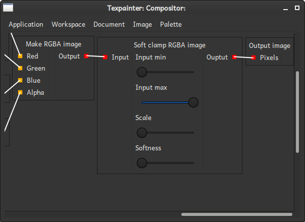

It is also worth mentioning that the blur effect is not very strong. To increase the effect, reduce
the size of the radial gradient. Also, experiment with "Aspect ratio", "Orientation", and "Number
of vertices". We will discuss "Scale with resolution" in the next section.

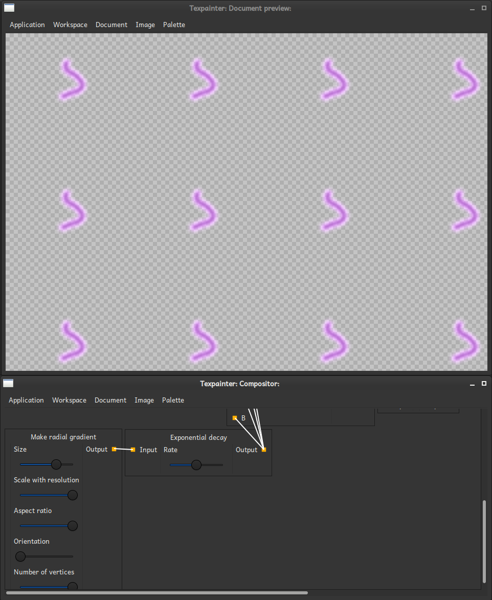

## Exportinig the result

Before exporting the image, it is a good idea to save your document. Do so by selecting "Save" from
the <a href="../app/document_menu.html">Document menu</a>. By convention, the filename extension for
Texpainter files is "txp". However you are free to choose any other extension if that works better
for you. When you have saved your document, its filename will appear in the title bar.