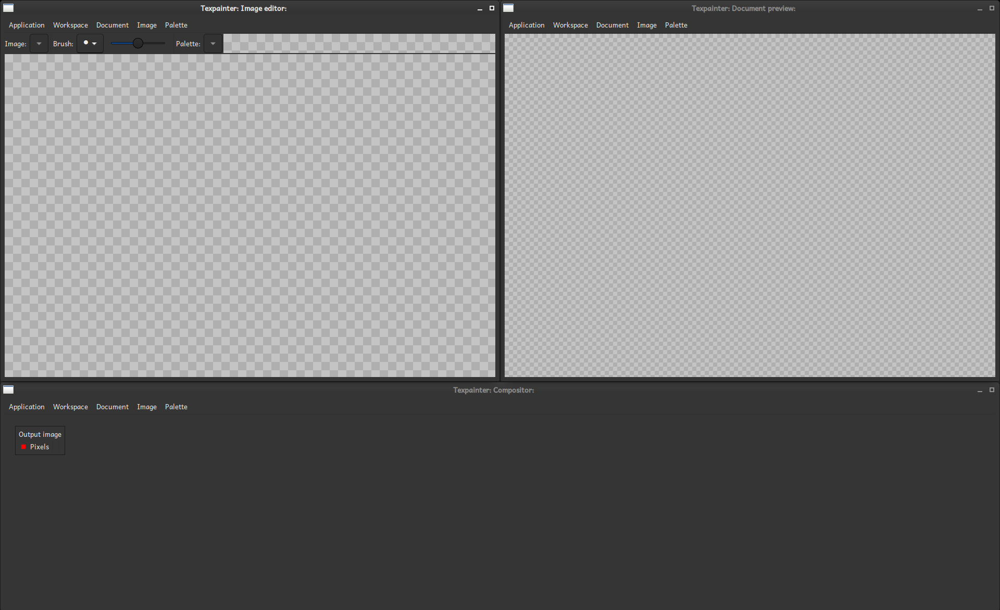

# Quick-start guide
This quick-start guide will show how to create a new texture image, how to apply some filters, and
how to export the resulting image.

## Creating a new texture image

To create a texture image, you first need to create a new document. You can do this by clicking
"Create a new document" in the <a href="../app/startup_menu.html">startup menu</a>. You will also
find the option in the <a href="../app/document_menu.html">Document menu</a>. This will bring up a
dialog box that allows you to specify the canvas size. The canvas is basically the domain where the
final render will be drawn. You will find more information about size specification in the
documentation for the <a href="../app/size_input.html">size input widget</a>.

When you have created a new document, you will have a workspace that looks something like this:

Now you need to create a new <a href="terminology.html#image">image</a> to paint on. You create a
new image from the <a href="../app/image_menu.html">Image menu</a>. After creating a new image, you
will see its name in the <a href="../app/image_editor.html">Image editor</a>. It also appears as a
new node in the <a href="../app/compositor.html">Compositor</a>.

Before you can paint anything, you need to have a <a href="terminology.html#palette">palette</a> to
select a color from. Palettes are managed from the <a href="../app/palette_menu">Palette menu</a>.
To change a color in the palette, right-click on the slot that should have the desired color. To
select what color to paint with, left-click.

To paint with the selected color, hold down the left mouse button while moving the cursor over the
drawing area. If you want to erase, right-click. Also, try to use the mouse wheel. Notice that the
image you are drawing to repeated. This makes it easy to draw a periodic pattern. If you pass the
image boundary (indicated with a solid line), it will wrap-around.

Now, it is time to have a look at the <a href="../app/compositor.html">Compositor</a>, and the
<a href="../app/document_preview.html">Document preview</a>. Currently, the Document preview shows
a checkerboard pattern. This indicates that there is nothing to be drawn. This is because nothing
has been connected to the input of the output node. To connect the nodes, you probably want to move
them around so you can see everything. To move a node, simply drag its title. It is a good idea to
move the output node to the right.

We want to copy the pixels of "texpainter demo" to the "Output image". Left-click either of red
<a href="terminology.html#port">ports</a>. When you move the mouse cursor, you will se a line
segment connecting the port with the mouse cursor.

Complete the connection by left-clicking on the other port.

Now, the document preview shows the pattern in scale 1:2.

## Applying some filters

TODO

## Exportinig the result

TODO